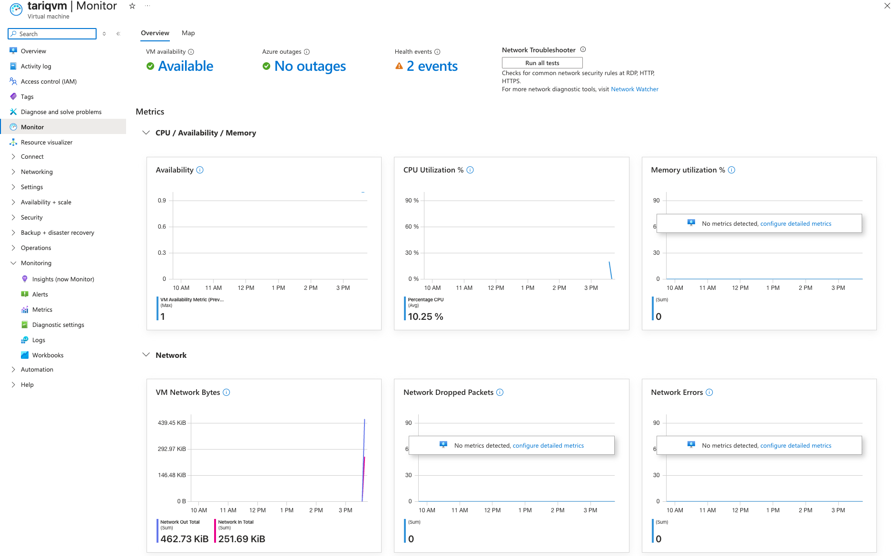
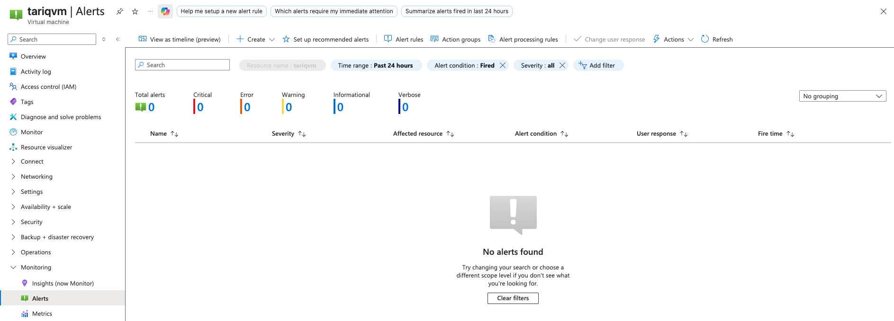
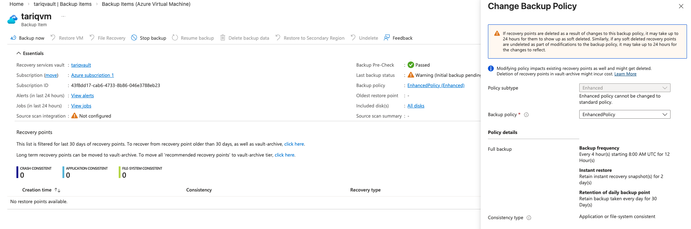
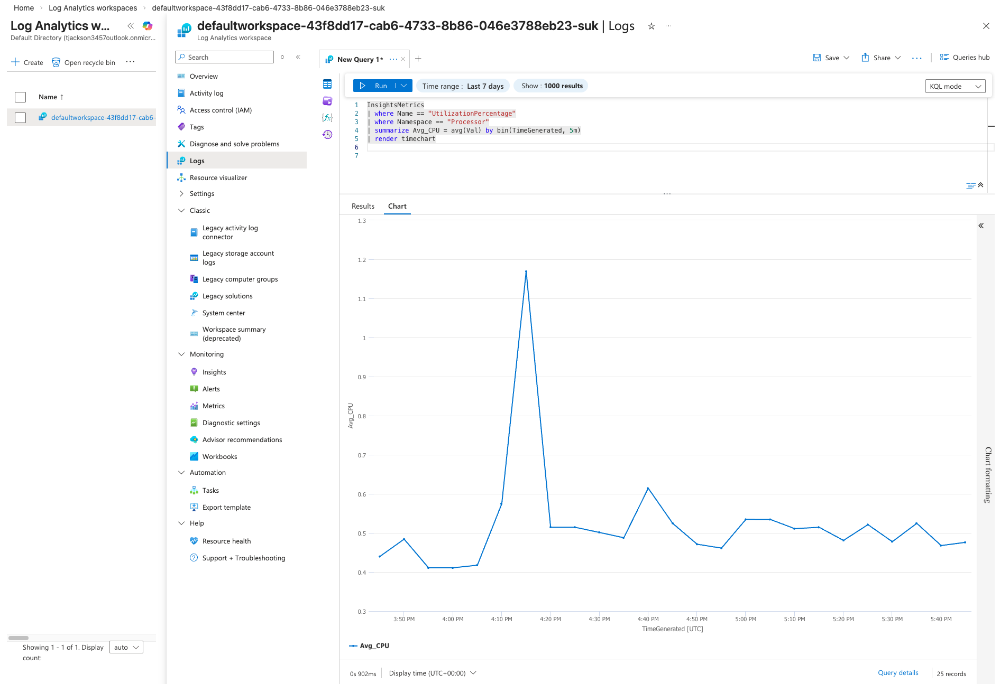
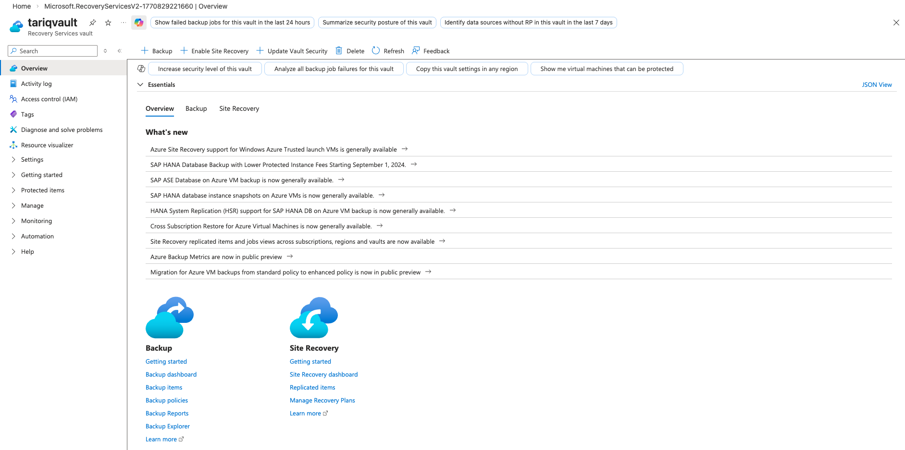
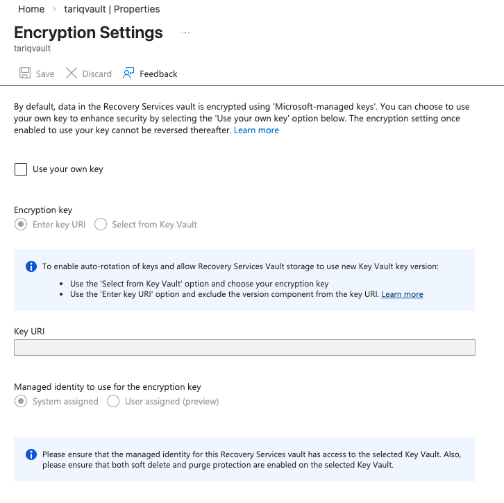

# 📊 Azure Monitoring, Backup & Recovery (AZ-104 Lab)

## 🔍 Overview

This project demonstrates how to monitor Azure Virtual Machines, configure alerts, enable backups, validate encryption, and analyze performance logs using Azure Monitor and Log Analytics. The goal is to simulate a real-world operations scenario where reliability, observability, and recovery are critical.

**Services used:**
- Azure Virtual Machines  
- Azure Monitor & VM Insights  
- Log Analytics Workspace (KQL)  
- Recovery Services Vault (Azure Backup)  
- Alerts & Action Groups  

## 🧠 Skills Demonstrated

- Azure Monitor & VM Insights  
- Log Analytics & KQL Queries  
- Azure Alerts & Action Groups  
- VM Backup & Recovery  
- Encryption at rest & TLS in transit  
- Observability & cloud operations  

## 🏗 Architecture Overview

VM → Azure Monitor → Log Analytics Workspace  
VM → Recovery Services Vault (Backup & Recovery)  
Alerts → Action Groups (Notifications)

## 1️⃣ Enable VM Monitoring (VM Insights)

VM Insights was enabled to collect performance metrics and logs from the VM.

## 2️⃣ Configure Alerts (CPU Threshold)

An alert was configured to trigger when CPU usage exceeds a defined threshold.  
This simulates proactive monitoring for performance issues.

## 3️⃣ Configure Backup (Recovery Services Vault)

The VM was protected using Azure Backup with an Enhanced Backup Policy.

- Recovery Services Vault created  
- VM registered for backup  
- Backup policy configured  
- Initial backup verified  

## 4️⃣ Log Analytics Queries (KQL)

KQL was used to query CPU performance metrics and visualize trends.

Example query used:

InsightsMetrics
| where Name == "UtilizationPercentage"
| where Namespace == "Processor"
| summarize Avg_CPU = avg(Val) by bin(TimeGenerated, 5m)
| render timechart

## 5️⃣ Recovery Services Vault Overview

Backup services and site recovery configuration verified within the vault.

## 6️⃣ Encryption Validation (At Rest + In Transit)

Azure Backup encrypts data at rest using Microsoft-managed keys.
Data in transit is encrypted using TLS (HTTPS) by default.

## 📌 Key Takeaways

- VM monitoring enables proactive issue detection
- Alerts notify teams before outages occur
- Azure Backup ensures recoverability
- Encryption protects data at rest and in transit
- Log Analytics provides visibility into performance trends

## 🧹 Cleanup (Cost Control)

- To avoid charges after completing the lab:
- Delete Recovery Services Vault
- Disable VM backups
- Delete VM and resource group
- Delete Log Analytics Workspace

## 📚 AZ-104 Exam Relevance
- This lab covers key AZ-104 topics:
- Monitor resources
- Configure alerts
- Implement backup and recovery
- Analyze logs
- Apply security best practices

